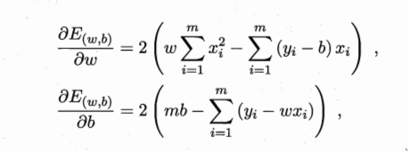

## 1. 基本形式
给定由d个属性描述的示例x=(x<sub>1</sub>;x<sub>2</sub>;...;x<sub>d</sub>)，其中xi是x在第i个属性上的取值，线性模型视图学得一个通过属性的线性组合来进行预测的函数，即


一般用向量形式写成：


其中，w=(w<sub>1</sub>;w<sub>2</sub>;...;w<sub>d</sub>)。w和b学得之后，模型就得以确定。

---

## 2. 线性回归
给定数据集D = {(x<sub>1</sub>, y<sub>1</sub>), (x<sub>2</sub>, y<sub>2</sub>), (x<sub>m</sub>, y<sub>m</sub>)}，其中x<sub>i</sub>=(x<sub>i1</sub>;x<sub>i2</sub>;...;x<sub>id</sub>)，y<sub>i</sub>∈R。

```线性回归试图学得一个线性模型，以尽可能准确地预测实际值。在输入值的时候需要注意，若将无序属性连续化则会不恰当地引入序关系，会对后续处理比如距离计算造成误差。例：{1, 2, 3}，“1”与“2”相近，而“2”与“3”相近；｛飞机，汽车，大炮｝之间没有序关系，应表示为向量｛0, 0, 1｝、｛0, 1, 0｝、｛1,0, 0｝```

令f(x<sub>i</sub>) = wx<sub>i</sub>+b，使得f(x<sub>i</sub>)≈y<sub>i</sub>。在确定w和b的过程中，均方误差是最常用的性能度量，因此需要让均方误差最小化，即：


均方误差有很好的几何意义，它对应了常用的欧几里得距离或简称“欧氏距离”。基于均方误差```最小化```来进行模拟求解的方法称为```“最小二乘法”```。在线性回归中，最小二乘法就是试图找到一条直线，使得所有样本到直线上的欧式距离之和最小。

 

对上述公式分别对w和b求偏导数，得到



然后，令上面两个等式为零，则得到w和b最优解的闭式解。

​线性模型虽然简单，但是有着丰富的变化，可拓展为对数线性回归，即：


实际上就是做了非线性映射


## 3. 对数几率回归

```主要用于分类，对线性回归模型进行非线性映射后用于数据分析```


为方便讨论，**仅考虑二分类问题**。其输出标记为y∈{0, 1}，而现行回归产生的预测值 $ z = \omega ^{T} + b $，需要将z转换为0/1值，即单位阶越函数。

$$
y = \left\{\begin{matrix}
0 & z < 0\\  
0.5 & z = 0\\  
1 & z > 0
\end{matrix}\right.
$$

但是，单位阶跃函数是不连续的，所以需要找到一个近似单位阶跃的函数，$ y = \frac{1}{1 + e^{-z}} $。将$ z = \omega ^{T} + b $带入上式。可得

$$
y = \frac{1}{1 + e^{-(\omega ^{T} + b)}}
$$

$$
\ln \frac{y}{1-y} = \omega ^{T} + b
$$

由$ \frac{y}{1-y} $可理解为正例与反例之比，也就是几率。

```对数几率回归```实际就是用$ \omega ^{T} + b $线性回归模型，通过替代函数$ y = \frac{1}{1 + e^{-(\omega ^{T} + b)}} $来逼近真实标记。

### 优点
- 无监督
- 获得近似概率，而非直接得到```预测类别```
- $ \ln \frac{y}{1-y} $ 为凸函数，很方便得出最优解

### 如何确定 $ \omega $ 和b

通过[```极大似然估计（MLE）法```](https://blog.csdn.net/zengxiantao1994/article/details/72787849)来确定


极大似然估计

总结起来，最大似然估计的目的就是：利用已知的样本结果，反推最有可能（最大概率）导致这样结果的参数值。

原理：极大似然估计是建立在极大似然原理的基础上的一个统计方法，是概率论在统计学中的应用。极大似然估计提供了一种给定观察数据来评估模型参数的方法，即：“模型已定，参数未知”。通过若干次试验，观察其结果，利用试验结果得到某个参数值能够使样本出现的概率为最大，则称为极大似然估计。

https://blog.csdn.net/zengxiantao1994/article/details/72787849

https://blog.csdn.net/u011508640/article/details/72815981/