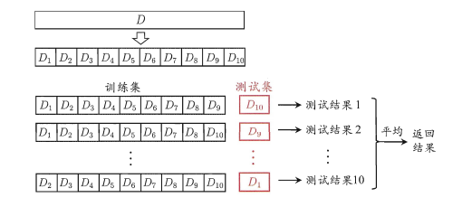
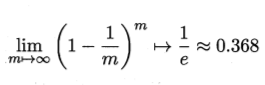

## 1. 留出法
```“留出法”```（hold-out）直接将数据集D划分为两个互斥的集合，其中一个集合作为训练集S，另一个作为测试集T，即D=S∪T，S∩T=∅。
在S上训练出模型后，用T来评估其测试误差，作为泛化误差（泛化：学得模型适用于新样本的能力；泛化误差：在新样本上的误差）的估计。

### 注意1：
训练/测试集的划分要尽可能保持数据分布的```一致性```，避免因数据划分过程引入额外的偏差而对最终结果产生影响，例如在分类任务中至少要保持样本的类别比例相似。
例1：若样本总数为100，其中70为正例，30为反例。那么在选取70%训练集时，应选取49正例与21反例。

### 注意2：
即便在给定训练/测试集的样本比例后，仍存在多种划分方式对初始数据集D进行分割。```一般情况下，不同的划分将产生不同的评估结果```。因此，单次使用留出法得到的估计结果往往不够稳定可靠，在使用留出法时，```一般要采用若干次随机划分、重复进行实验评估后取平均值```作为留出法的评估结果。

#### 留出法的分割方法没有完美的分割方法，常见做法是将大约2/3~4/5的样本用于训练，剩余样本作用于测试。

---

## 2. 交叉验证法
```交叉验证法```也称为```k折交叉验证```。
- 先将数据集D分为k个大小相似的```互斥子集```，即D=D1∪D2∪...∪Dk，Di∩Dj=∅（i≠j）。每个子集Di都尽可能保持数据分布的一致性。
- 然后，每次用```k-1个子集的并集```作为训练集，```余下的那个子集```作为测试集；这样就可以获得k组训练/测试集用于训练和测试。
- 最终返回k个测试结果的均值作为评估结果。
- 显然，这种做法产生的结果的稳定性和保真性在很大程度上取决与k的取值。常用的k的值为```10```。




### 特例：
```留一法(Leave-One-Out，简称：LOO)```：假定数据集D包含m个样本，若令k=m，那么得到了交叉验证法的一个特例，即：```留一法```。

- 优点：
1. LOO不受随机样本划分方式的影响，因为m个样本只有唯一的方式划分为m个子集（每个子集有且仅有一个样本）
2. LOO使用的训练集只与初始数据集差一个样本，这就使得在绝大多数情况下，LOO得到的评估结果与用D训练出的结果很相似。
3. 通常情况下，LOO法得到的结果比较准确
- 缺点：
1. 当数据量很大时（100W的数据集），LOO的计算开销巨大
2. 并不是所有情况下，LOO法的结果都是最准确的。

---

## 3. 自助法（bootstrapping）
```自助法```也可翻译为```可重复采样法```。
给定包含m个样本的数据集D，对它进行采样产生数据集D'。

- 每次随机从D中挑选一个样本，将其拷贝放入D'
- 将该样本放回数据集D，使得该样本在下次采样时仍有可能被采集到
- 过程重复执行m次后，得到采样结果D'

有一部分数据始终没有被采样，这些数据不被采样到的概率为：


### 当数据集较小、难以有效划分时，自助法很有用。然而，自助法产生的数据集改变了初始数据集的分布，这会引入估计偏差。因此，在数据量足够多时，留出法和交叉验证法更常用。

## 4. 调参与最终模型
### 调参
调参往往会直接影响结果的准确性，而且会消耗大量的时间。所以，现实中常用的做法，是对每个参数选定一个返回和和变化步长，例如在[0, 0.2]范围内以0.05为步长，则实际评估的时候参数只有5个，最终是从这5个候选值中选定参数。显然，这样的做法选出的参数并不是“最佳”的，但这是在计算开销和性能之间进行折中后的结果。

### 最终模型
给定包含m个样本的数据集D，在模型评估与选择过程中由于需要留出一部分进行评估测试，事实上我们只使用了一部分数据训练模型。因此，在模型选择完成后，学习算法和参数配置已经选定，因此应该用数据集D重新训练模型。这个模型在训练过程中使用了所有m个样本，这才是我们的最终模型。

